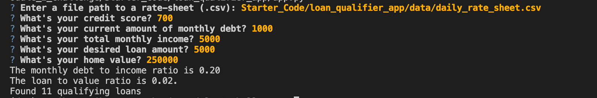
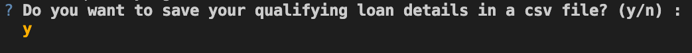
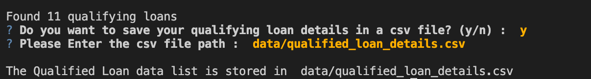
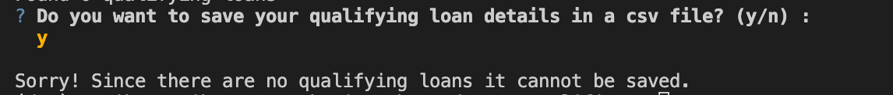

# Enhanced_Loan_Qualifier

Enhanced Loan Qualifier Application is a user interactive loan qualifier application. This application accpets It helps user by proving a list of loans they are qualified for given their financial data.

---

## Technologies

This application works on python 3.7 and uses following libraries:

* [fire](https://github.com/google/python-fire) - For the command line interface and entry-point.

* [questionary](https://github.com/tmbo/questionary) - For user interactive inputs and dialogs.

---

## Installation Guide

Follow the following instructions before using the application.

```python
  pip install fire
  pip install questionary
```
---

## Usage

To use the Enhanced Loan Qualifier Application
 * clone the repository 

 ```python
    git clone git@github.com:rupikaranjan/Enhanced_Loan_Qualifier.git
```

 * Run the **app.py**

```python
python app.py
```

* Upon launching the Loan Qualifier Application the user will be prompted for bank data sheet and customer's financial details.



* After Entering all the details the application will display the number of loans the customer is qualified for.

* The user will be promted whether to save their qualified loan details in a file.



* If the user wish to save(enter 'y') and if there are qualified loan details to be saved the application asks for the filepath from user to save the details.



* If the user wish to save(enter 'y') and if there are **no qualified loan details** to be saved the application exits with a message as follows.



* If the user does not wish to save(enter 'n') then the application exits with following message.


---

## Contributors

Created by Rupika Ranjan Babu

---

## License

MIT
